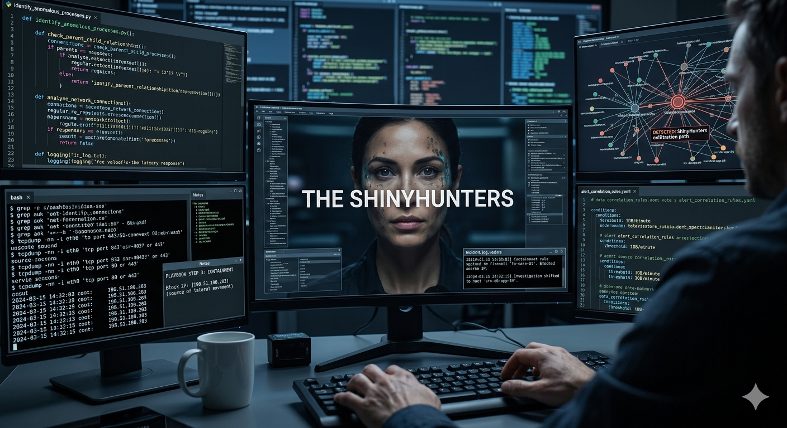

# 🛡️ Canvas SaaS Supply Chain Breach: An AI-Driven Analysis

**Author:** Cuong Dang  
**Academic Affiliation:** Houston City College (HCC) - ITAI 1372 AI in Cybersecurity  
**Instructor:** Dr. Ade Odujinrin  

## 📋 Project Overview
This repository serves as a real-world case study of the **May 2026 cybersecurity incident** involving the Canvas LMS platform (Instructure), claimed by the threat actor group **ShinyHunters**. This project analyzes the attack vectors and proposes AI-based defensive strategies.

## 🧠 Key Research Areas
*   **Attack Vector:** Analyzing OAuth Token Theft and SaaS-to-SaaS data exfiltration.
*   **Threat Actor Profiling:** Technical deep-dive into ShinyHunters' TTPs (Tactics, Techniques, and Procedures).
*   **AI Defense Models:** Utilizing Recurrent Neural Networks (RNN) for User Entity Behavior Analytics (UEBA).
*   **Incident Response:** Professional reporting and containment strategies for academic environments.

## 🛠️ Tech Stack & Concepts
- **Framework:** MITRE ATT&CK Mapping
- **Detection:** Anomaly Detection, Zero Trust Architecture (ZTA)
- **Monitoring:** Azure/Microsoft 365 Audit Logs, API Traffic Analysis

## 📁 Repository Structure
- `/analysis`: In-depth technical write-ups.
- `/incident-response`: Templates for reporting and mitigation.
- `/assets`: Visualizations of the threat landscape.

---
*Disclaimer: This project is for educational purposes only as part of the HCC Cybersecurity program.*
