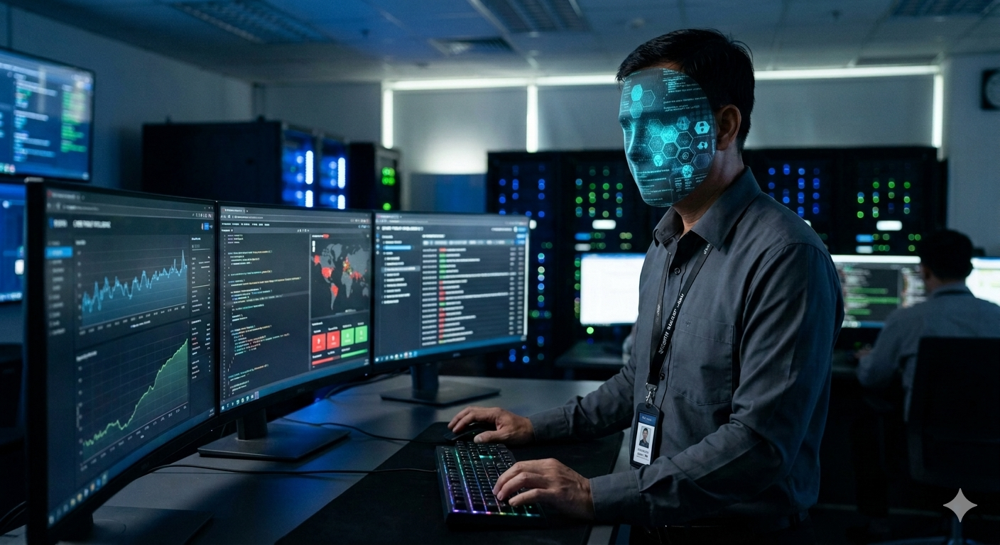
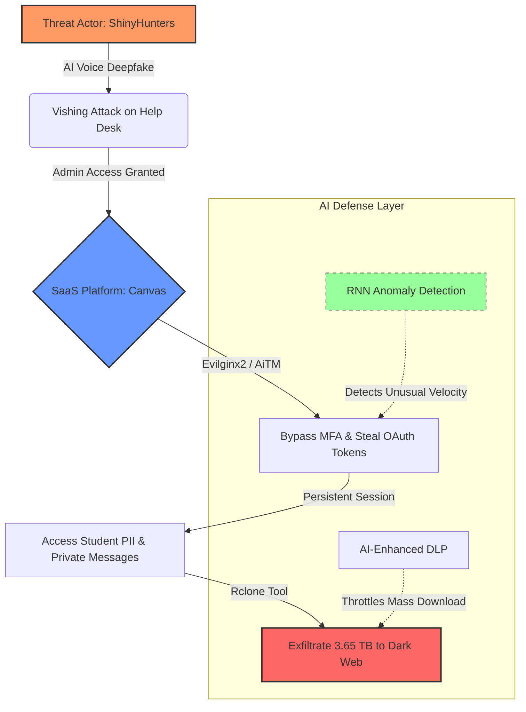

# 🕵️ Technical Analysis: The 2026 Canvas/Instructure Cybersecurity Incident

**Author:** Cuong Dang  
**Course:** ITAI 1372 - AI in Cybersecurity (Houston City College)  
**Date:** May 7, 2026

---

## 1. Executive Summary
This report analyzes the large-scale supply chain attack executed by the threat actor group **ShinyHunters** against the **Canvas LMS (Instructure)** platform. The breach resulted in the exfiltration of approximately 3.65 TB of sensitive data, affecting thousands of institutions, including Houston City College (HCC). This analysis focuses on the transition from traditional ransomware to **Modern Identity Extortion** and proposes AI-based countermeasures.

## 2. Visual Attack Flow & Defense Layer
The following diagram illustrates the lifecycle of the breach and where AI-driven defenses could have intervened:

## 3. Root Causes (Vulnerability Analysis)
The incident succeeded due to several systemic weaknesses in the SaaS ecosystem:
*   **SaaS Supply Chain Concentration:** Centralized platforms create a "Single Point of Failure." Compromising Instructure granted access to thousands of downstream schools.
*   **Session Persistence Issues:** Long-lived Session Tokens allowed attackers to bypass Multi-Factor Authentication (MFA) requirements after the initial session hijack.
*   **Human Factor (Identity Gaps):** Inadequate verification protocols for administrative support allowed for **Vishing** (Voice Phishing) success.

## 4. Threat Actor Tooling (TTPs)
ShinyHunters utilized a modern toolkit to bypass traditional perimeter defenses:
*   **Adversary-in-the-Middle (AiTM):** Tools like **Evilginx2** and **Modlishka** were used to proxy login attempts, capturing credentials and session cookies simultaneously.
*   **AuraInspector:** An open-source scanner used to identify misconfigured cloud APIs and exposed metadata.
*   **Rclone:** A command-line utility optimized for high-speed cloud-to-cloud data exfiltration (S3/Azure/Google Cloud).
*   **Generative AI (Voice Deepfakes):** Used to create realistic voice clones for social engineering administrative staff.

## 5. Proposed AI-Driven Defensive Strategies
To minimize the **Blast Radius** of future incidents, I propose:
1.  **Identity Threat Detection & Response (ITDR):** Implementing **RNN (Recurrent Neural Networks)** to model "Normal User Velocity." If a token is used from Houston and then London within 5 minutes, the AI triggers an immediate **Token Revocation**.
2.  **Unsupervised Anomaly Detection:** Using clustering algorithms to identify "Low and Slow" data exfiltration that traditional rule-based DLP systems might miss.

## 6. Personal Incident Response (IR) Actions
As a proactive security student, I have performed the following:
*   **Audit:** Conducted a forensic review of my **Microsoft 365 Audit Logs** to check for unauthorized access.
*   **Containment:** Revoked all 3rd-party OAuth permissions linked to my institutional account.
*   **Reporting:** Provided a technical summary to the HCC IT Department to assist in mapping local Indicators of Compromise (IoCs).

---
*This report is submitted as part of the academic requirements for the AI in Cybersecurity program at Houston City College.*
